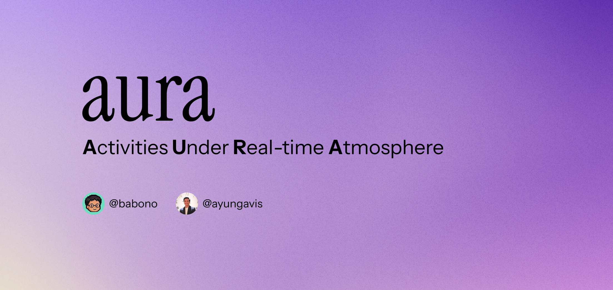

# Aura



⚙️ [Repository](https://github.com/ayungavis/aura-app)

A weather activity recommendation app built with SwiftUI. Shows current weather, hourly forecasts, and suggests activities and food based on real-time conditions — powered by on-device Apple Intelligence when available.

## Project layout

```
AuraApp/       the app target
AuraShared/    code compiled into BOTH the app and the widget
AuraWidget/    the Home Screen widget extension
```

`AuraShared` exists because the widget needs the weather models, the cache and
the service layer. Both targets reference it as a synchronized folder, so adding
a file there puts it in both automatically.

## Weather data

Weather resolves through `WeatherServiceRouter`:

1. the shared on-disk cache (15 minute TTL, also read by the widget),
2. **Apple WeatherKit**,
3. **Open-Meteo**, if WeatherKit is unavailable.

The router remembers a permanent WeatherKit failure for the rest of the session
so a misconfigured entitlement does not cost a failing round trip on every
refresh.

### Enabling WeatherKit

The code and entitlements are in place, but WeatherKit will fail until the App ID
is provisioned. In the [developer portal](https://developer.apple.com/account):

1. **Certificates, IDs & Profiles → Identifiers →** `com.babono.AuraApp`
2. Enable **WeatherKit**, and enable the **App Groups** capability with
   `group.com.babono.AuraApp`.
3. Do the same for `com.babono.AuraApp.AuraWidget`.
4. Enable WeatherKit for the app in **App Store Connect → your app → Services**.
5. Regenerate provisioning profiles (or let Xcode's automatic signing do it).

Until that is done the app silently serves Open-Meteo, which is the intended
behaviour — but note the footer attribution changes accordingly.

> Apple **requires** the Apple Weather mark and a link to their legal page on any
> screen showing WeatherKit data. That is `WeatherAttributionView`; do not remove
> it.

## Widget

`AuraWidget` ships small and medium Home Screen sizes. The app writes a compact
`WidgetWeatherSnapshot` to the shared App Group after every successful fetch and
the widget renders from it, refetching for the last known coordinate only when
the snapshot goes stale. That keeps the extension off the location subsystem and
off the WeatherKit quota.

## Requirements

- Xcode 17+
- iOS 26.0+
- Apple Intelligence–capable device (iPhone 15 Pro+ / M1+ Mac / iPad with A17 Pro+) for AI recommendations (rule-based fallback on other devices)

## Getting Started

### 1. Clone

```bash
git clone https://github.com/ayungavis/aura-app.git
cd aura-app
```

### 2. Open & Run

```bash
open AuraApp.xcodeproj
```

Select the **AuraApp** scheme and run on a simulator or device. The app requests location access on first launch.

### 3. Build from Terminal

```bash
xcodebuild build -project AuraApp.xcodeproj -scheme AuraApp \
  -destination 'platform=iOS Simulator,name=iPhone 17'
```

## Architecture

The app follows **MVVM (Model-View-ViewModel)** with protocol-oriented dependency injection.

### Navigation Flow

```
SplashScreen (3s) → CurrentWeatherView → ListView → DetailView
```

`AppRouter` (`@Observable`) drives navigation via `NavigationStack` + `NavigationPath`. Routes are defined in `AppDestination`.

### Project Structure

```
AuraApp/
├── App/                    # Entry point, router, root view, config
├── Core/
│   ├── Models/             # App-only data models
│   ├── Services/           # Places + recommendation services
│   └── Extensions/         # Swift extensions
├── Features/
│   ├── CurrentWeather/     # Main weather screen
│   │   ├── Components/     # Reusable UI components
│   │   ├── Models/         # Feature-specific models
│   │   ├── CurrentWeatherView.swift
│   │   ├── CurrentWeatherViewModel.swift
│   │   └── CurrentWeatherMockData.swift
│   ├── ListView/           # Places listing
│   ├── DetailView/         # Place details
│   └── SplashScreen/       # Animated splash
└── Shared/
    └── Components/         # Cross-feature UI components

AuraShared/                 # compiled into the app AND the widget
├── Models/                 # WeatherData
├── Services/               # WeatherKit, Open-Meteo, the router
├── Storage/                # LocalCache, WidgetDataStore
└── Utilities/              # AppLogger

AuraWidget/                 # Home Screen widget extension
```

### MVVM Pattern

Each feature follows the same structure:

```
View (SwiftUI)  →  ViewModel (@MainActor, @Observable)  →  Service (Protocol)
```

**View** — renders state, handles user interaction only. Owns the ViewModel via `@StateObject`.

**ViewModel** — holds `@Published` state, calls async service methods, never imports SwiftUI views. All dependencies injected via protocols with default implementations.

**Service** — handles networking/caching, defined by a protocol for testability.

Example dependency chain for the weather screen:

```
CurrentWeatherView
  @StateObject CurrentWeatherViewModel
    ├── WeatherServiceProtocol ← OpenMeteoWeatherService
    ├── LocationManagerProtocol ← LocationManager
    └── RecommendationServiceProtocol ← AIRecommendationService / FallbackRecommendationService
```

### Key Patterns

| Pattern                       | Where                            | Why                                    |
| ----------------------------- | -------------------------------- | -------------------------------------- |
| Protocol-oriented DI          | All ViewModels                   | Testable, swappable implementations    |
| `@MainActor`                  | ViewModels & Services            | Thread safety for UI updates           |
| `defer { isLoading = false }` | All async fetch methods          | Loading state always resets            |
| `async let` parallel fetch    | DetailViewModel, recommendations | Independent API calls run concurrently |
| Three-state rendering         | All feature Views                | `loading → error → content` with retry |
| Progressive loading           | List/Detail Views                | Show stale data during refresh         |
| Disk cache with TTL           | LocalCache                       | 15-min weather cache, 24h default      |

### Recommendation System

Activity and food recommendations adapt to current weather:

```
RecommendationServiceFactory.create()
  ├── AIRecommendationService    (Apple Intelligence devices)
  │   └── Foundation Models @Generable → structured output
  └── FallbackRecommendationService   (all other devices)
      └── WeatherCondition enum → curated maps
```

Both return `[Activity]` and `[Food]` models with SF Symbol icon names. The factory checks `SystemLanguageModel.default.availability` at runtime.

### Data Sources

| Data                           | Source                                | Caching           |
| ------------------------------ | ------------------------------------- | ----------------- |
| Weather (current + hourly)     | Apple WeatherKit, Open-Meteo fallback | 15-min disk cache |
| Place search                   | Apple Maps (`MKLocalSearch`)          | None              |
| Place details, photos, reviews | Apple Maps place card                 | None              |
| Location name                  | CLGeocoder (reverse geocode)          | None              |
| Activity/food recommendations  | Apple Foundation Models or rule-based | None (stateless)  |

### Logging

All network, cache, location, weather, and recommendation events are logged via `AppLogger` using `os.Logger`. Check the Xcode console or Console.app with subsystem filter `com.ayungavis.AuraApp`.

## Dependencies

Managed through Xcode SPM (no `Package.swift`):

- **[OpenMeteoSdk](https://github.com/open-meteo/sdk)** — weather data via FlatBuffers
- **[FlatBuffers](https://github.com/google/flatbuffers)** — serialization (transitive)

## Team

Built by a 2-person team learning Swift and iOS development.

- Wahyu Kurniawan ([@ayungavis](https://github.com/ayungavis))
- M Nurul Akbar ([@babono](https://github.com/babono))
